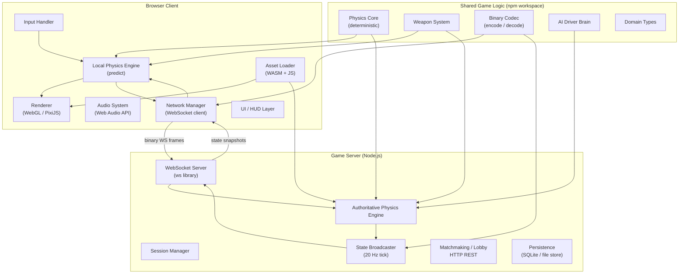

# Design Document: Deathtrack Multiplayer Recreation

## Overview

This document describes the technical design for a faithful modern recreation of **Deathtrack** (Dynamix/Activision, 1989), extended with real-time online multiplayer for 2–8 players. The recreation targets modern web browsers (Chrome/Firefox/Edge 120+) as the primary platform, with an optional native desktop build via Electron or Tauri.

The game is a vehicular combat racer with top-down pseudo-3D perspective. Players select from three car chassis, configure weapon and component loadouts, then race across ten city tracks against AI opponents or other players. Career mode provides persistent progression through prize money, component purchases, and a high-score table.

The central engineering challenges are:

- **Deterministic physics**: A 60 Hz fixed-timestep simulation that produces identical outputs given the same inputs and seed, enabling network state validation and replay.
- **Online multiplayer**: A server-authoritative architecture with client-side prediction and server reconciliation, keeping 2–8 players synchronised at 20 Hz over typical broadband connections.
- **Asset compatibility**: A pipeline for loading original Death Track game files (`.TRK`, `.MAP`, `.BMP`, `.TBL`, `.MUS`, `.SCR`, plus `FNT:` fonts) and converting them to web-native representations at runtime. These files use the standard Dynamix RES chunk container; palettes live inside `PAL:`/`VGA:` chunks (there is no separate `.PALS` file). See `research/dynamix-formats.md` for the byte-level format reference.
- **Browser performance**: Sustained 60 fps rendering with up to 8 participants using WebGL-backed sprite rendering.

### Key Design Decisions

| Decision | Choice | Rationale |
|---|---|---|
| Rendering backend | WebGL (via PixiJS v8) | Sprite batching, GPU-accelerated palette lookup, 60 fps at full participant load |
| Physics execution | Shared module on client and server | Determinism; server is authoritative, client predicts locally |
| Network transport | WebSocket (TCP) with binary frames | Simpler operational model than WebRTC for a server-authoritative topology; 20 Hz state sync keeps packets small enough that TCP head-of-line blocking is acceptable |
| Server runtime | Node.js 20 LTS + TypeScript | Shared game-logic module with the client; fast iteration |
| Property-based testing | fast-check | First-class TypeScript support; integrates with Vitest |
| Serialisation | Custom binary codec (MessagePack-inspired) | Deterministic field ordering; round-trip correctness is testable; fits within the 512-byte per-participant packet cap |

---

## Architecture

### High-Level System Diagram



### Monorepo Package Structure

```
deathtrack/
├── packages/
│   ├── shared/          # Deterministic physics, weapon system, codec, types
│   ├── client/          # Browser client (Vite + PixiJS)
│   ├── server/          # Game server (Node.js ws)
│   └── tools/           # Asset conversion CLI (original file → JSON/binary)
├── assets/              # Converted game assets (gitignored raw originals)
└── tests/               # Cross-package integration and property tests
```

### Process Architecture

```
┌──────────────────────────────────────────┐
│  Browser Tab (client)                     │
│  ┌─────────────────────────────────────┐ │
│  │  Game Loop (requestAnimationFrame)   │ │
│  │  ┌──────────┐  ┌───────────────────┐│ │
│  │  │ Render   │  │ Network tick      ││ │
│  │  │  60 Hz   │  │ (recv / predict)  ││ │
│  │  └──────────┘  └───────────────────┘│ │
│  └─────────────────────────────────────┘ │
└──────────────────────────────────────────┘
            │  WebSocket (binary)
            ▼
┌──────────────────────────────────────────┐
│  Game Server (Node.js)                    │
│  ┌─────────────────────────────────────┐ │
│  │  Authority Loop (setInterval 50 ms) │ │
│  │  ┌──────────┐  ┌───────────────────┐│ │
│  │  │ Physics  │  │ State broadcast   ││ │
│  │  │ step 60Hz│  │ 20 Hz             ││ │
│  │  └──────────┘  └───────────────────┘│ │
│  └─────────────────────────────────────┘ │
└──────────────────────────────────────────┘
```

The server runs a physics loop at 60 Hz internally (16.67 ms `setImmediate` ticks) and broadcasts a condensed state snapshot to all clients every 50 ms (20 Hz). Clients run the same physics step locally for prediction, receive server snapshots, and reconcile.

---

## Components and Interfaces

### Physics Engine

The Physics Engine is implemented as a pure-function module in `packages/shared/src/physics/`. All state is held in plain data structures with no hidden mutable globals; each step is `(state, inputs, dt) → state`. This guarantees determinism and makes snapshot-and-restore trivial.

```typescript
// packages/shared/src/physics/types.ts
export interface Vec2 { x: number; y: number }

export interface CarPhysicsState {
  id: ParticipantId;
  position: Vec2;         // track-space units
  velocity: Vec2;         // units/second
  heading: number;        // radians, 0 = north
  speed: number;          // scalar, units/second
  angularVelocity: number;
  onTrack: boolean;
  airborne: boolean;
  airborneHeight: number; // units above surface
  airborneVY: number;     // vertical velocity
}

export interface CarInputs {
  throttle: number;   // 0..1
  brake: number;      // 0..1
  steer: number;      // -1..1
  fireForward: boolean;
  fireRear: boolean;
}

export interface PhysicsStepResult {
  cars: ReadonlyArray<CarPhysicsState>;
  events: ReadonlyArray<PhysicsEvent>; // collisions, jumps, eliminations
}

export function stepPhysics(
  state: Readonly<WorldPhysicsState>,
  inputs: ReadonlyMap<ParticipantId, CarInputs>,
  dt: number,          // always 1/60 seconds
  rng: RNG,
): PhysicsStepResult { /* ... */ }
```

**Determinism guarantees:**
- All floating-point arithmetic uses standard IEEE 754 doubles. Cross-platform determinism is not guaranteed by the spec but is sufficient for client–server reconciliation on homogeneous JS engines.
- The RNG is a seeded xorshift64 passed explicitly; no `Math.random()` calls inside the physics step.
- Array iteration order over participant collections is always sorted by `ParticipantId` (a stable numeric key).

### Renderer

Built on **PixiJS v8** with a `WebGLRenderer`. The renderer is a one-way consumer of game state: it reads the latest interpolated state and draws it. It never writes to simulation state.

```typescript
// packages/client/src/renderer/Renderer.ts
export class Renderer {
  private app: PIXI.Application;
  private trackLayer: PIXI.Container;
  private carLayer: PIXI.Container;
  private hazardLayer: PIXI.Container;
  private hudLayer: PIXI.Container;

  /** Called once per animation frame. state is the interpolated snapshot. */
  render(state: RenderState, alpha: number): void { /* ... */ }

  /** Adjusts LOD when frame rate drops below 30 fps for > 2s */
  private adaptLOD(fps: number): void { /* ... */ }
}
```

**Pseudo-3D perspective:** The track is rendered using a scanline-based projection. For each screen row, the world-space depth is computed and road/scenery tiles are sampled from the converted track texture atlas. Car sprites are scaled and vertically offset based on depth. This matches the original's look without requiring a 3D scene graph.

**Palette emulation:** All assets are decoded to a 256-colour indexed palette. A WebGL fragment shader performs palette lookup via a 256×1 RGBA texture uniform, allowing palette animation and flash effects without CPU-side pixel writes.

**Draw layers (back to front):**
1. Road surface
2. Track boundaries
3. Scenery objects (distance-sorted)
4. Hazard objects (mines, caltrops)
5. Car sprites (depth-sorted)
6. Projectile sprites
7. Explosion animations
8. HUD overlay

### Weapon System

```typescript
// packages/shared/src/weapons/WeaponSystem.ts
export interface WeaponConfig {
  id: WeaponId;
  category: WeaponCategory; // 'forward' | 'rear' | 'ram' | 'spike'
  damage: number;           // HP per hit or HP/s for beam weapons
  projectileSpeed?: number; // units/second, absent for rear-drops
  ammoMax: number;          // 0..999
  beamDPS?: number;         // HP/s, only for laser/beam
  rangeCells?: number;      // maximum effective range
}

export interface ActiveProjectile {
  id: ProjectileId;
  ownerId: ParticipantId;
  weaponId: WeaponId;
  position: Vec2;
  velocity: Vec2;
  spawnTick: number;
}

export interface PlacedHazard {
  id: HazardId;
  ownerId: ParticipantId;
  weaponId: WeaponId;
  position: Vec2;
  spawnTick: number;
  triggered: boolean;
}

export function stepWeapons(
  state: Readonly<WeaponSystemState>,
  carStates: ReadonlyArray<CarPhysicsState>,
  dt: number,
): WeaponStepResult { /* ... */ }
```

Weapon events (fire, hit, elimination) are emitted as typed events in `WeaponStepResult` and consumed by the Network Manager (to broadcast) and the Audio System (to play SFX).

### AI Driver

```typescript
// packages/shared/src/ai/AIBrain.ts
export interface AIDriverConfig {
  character: AICharacter; // 'sly' | 'angel' | 'crimson' | ...
  skillTier: SkillTier;  // 'novice' | 'standard' | 'expert'
  aggression: number;    // 1..5
}

export function computeAIInputs(
  driver: AIDriverState,
  world: Readonly<WorldPhysicsState>,
  config: AIDriverConfig,
  rng: RNG,
): CarInputs { /* ... */ }
```

AI decisions are computed inside the authoritative server loop using the same `RNG` passed to the physics step, preserving overall simulation determinism. The AI uses a waypoint graph derived from track data, with lookahead to select the racing line based on aggression level.

### Network Manager (Client)

```typescript
// packages/client/src/network/NetworkManager.ts
export class NetworkManager {
  /** Send a player input frame to the server */
  sendInput(frame: InputFrame): void;

  /** Called when a state snapshot arrives from the server */
  onSnapshot(snapshot: StateSnapshot): void;

  /** Reconcile local prediction with authoritative snapshot */
  reconcile(snapshot: StateSnapshot): void;

  /** Returns the interpolated render state for a given timestamp */
  getInterpolatedState(renderTime: number): RenderState;
}
```

**Client-side prediction flow:**
1. Each local input is applied immediately to the local physics state (predict forward).
2. Input frames are buffered in a ring buffer (up to 30 frames = 0.5 seconds).
3. On snapshot arrival: find the snapshot's tick in the buffer, re-simulate from that point with the buffered inputs.
4. If the correction delta exceeds 2 m (≤150 ms latency) or 5 m (>150 ms), smooth-lerp the car to the corrected position over the next 3 render frames to avoid visual pop.

### Network Manager (Server)

```typescript
// packages/server/src/network/ServerNetworkManager.ts
export class ServerNetworkManager {
  /** Accept an input frame from a client; validate timestamp */
  receiveInput(participantId: ParticipantId, frame: InputFrame): void;

  /** Called by the authority loop at 20 Hz; broadcasts snapshot */
  broadcastSnapshot(state: WorldPhysicsState, tick: number): void;

  /** Detect and handle disconnection */
  onDisconnect(participantId: ParticipantId): void;
}
```

### Asset Loader

```typescript
// packages/shared/src/assets/AssetLoader.ts
export interface TrackData {
  id: TrackId;
  name: string;
  roadGeometry: RoadSegment[];
  jumpRamps: JumpRamp[];
  waypointGraph: WaypointGraph;
  pitLane: PitLaneData;
  hazardZones: HazardZone[];
  scenery: SceneryObject[];
  palette: Uint8Array;   // 256×3 RGB
}

export interface AssetLoader {
  loadTrack(id: TrackId): Promise<TrackData>;
  loadCarSprites(chassis: ChassisId): Promise<SpriteSheet>;
  loadWeaponTable(): Promise<WeaponTable>;
  loadMusicTrack(screen: MusicContext): Promise<AudioBuffer>;
}
```

Original file parsing follows the real Dynamix formats documented in
`research/dynamix-formats.md`. Death Track files are trees of Dynamix **RES chunks**
(a 3-character ASCII ID plus `':'`, then a `uint32` whose high bit flags a container and
whose low 31 bits give the byte length), and leaf payloads may be compressed with one of
three schemes. Parsing is therefore layered:

**Foundation, in `packages/tools/src/parsers/`:**
- `ChunkReader` — walks the Dynamix RES chunk tree recursively, yielding a `ChunkNode`
  structure (`id`, `isContainer`, `length`, `data`, `children`). Every format decoder
  consumes this rather than parsing raw offsets directly.
- Shared **decompressors** — `RLE` (method `0x01`), `LZW` (method `0x02`, dynamic 9–12 bit
  little-endian codes with code 256 = dictionary reset), and `LH1` (method `0x03`, the LHA
  `lh1` method). A dispatcher keyed on the leaf `compressionType` byte selects the scheme.

**Documented-format decoders (built directly from the format reference):**
- Palette decoder — `PAL:` container → `VGA:` sub-block, 0–63 channel values scaled to 0–255.
- Screen decoder — `SCR:` full-screen 320×200 image; two-plane VGA form combined into
  palette indices, then RGBA.
- Font decoder — `FNT:` (Dynamix Font Format v4/v5).
- Sprite decoder — `BMP:` container (`INF:` info + `SCN:`/`OFF:` 2-bit-command RLE, and the
  `BIN:` single-image form), from The Incredible Machine Image Format.

**Reverse-engineered decoders (layout confirmed against the real bytes, not assumed):**
- Track decoder — `RTK:` payload from `.TRK` → road geometry, jump ramps, waypoint graph,
  pit lane, hazards, scenery.
- Minimap decoder — the `.MAP` overhead payload.
- Stat-table decoder — the `.TBL` files (which lead with binary count/version words rather
  than an ASCII magic).
- Music — OPL2/AdLib `.MUS` sequences, converted to OGG at build time.

Parsed assets are serialised to a compact binary format and bundled into the web build. The original DOS files are never shipped to end users.

### Audio System

```typescript
// packages/client/src/audio/AudioSystem.ts
export class AudioSystem {
  private channels: AudioChannel[]; // 8 slots
  private musicGain: GainNode;
  private sfxGain: GainNode;

  playSFX(id: SFXId): void;
  playMusic(context: MusicContext): void;
  setMusicEnabled(on: boolean): void;
  setSFXEnabled(on: boolean): void;
}
```

The Web Audio API provides mixing, gain control, and the 8-channel limit. When all 8 SFX channels are active, `playSFX` evicts the channel with the smallest remaining playback duration.

### Session Manager (Server)

```typescript
// packages/server/src/session/SessionManager.ts
export class SessionManager {
  createSession(config: SessionConfig): Session;
  joinSession(sessionId: SessionId, player: PlayerInfo): JoinResult;
  listOpenSessions(): SessionSummary[];
  transferHost(session: Session): void;
  closeSession(sessionId: SessionId): void;
}
```

Sessions are stored in an in-process `Map`. For production scale (>50 concurrent sessions), this would be externalised to Redis, but a single-process store is sufficient for the target player count.

---

## Data Models

### Car

```typescript
export interface ChassisDef {
  id: ChassisId;          // 'hellcat' | 'crusher' | 'pitbull'
  name: string;
  baseStats: CarBaseStats;
  spriteSheet: SpriteSheetRef;
}

export interface CarBaseStats {
  topSpeed: number;       // units/s, 1..100
  acceleration: number;   // units/s², 1..100
  armor: number;          // HP, 1..200
  handling: number;       // turn rate factor, 1..100
}

export interface ComponentDef {
  id: ComponentId;
  slot: ComponentSlot;    // 'engine' | 'brakes' | 'transmission' | 'tires' | 'airfoil' | 'armor'
  name: string;
  price: number;
  statDeltas: Partial<CarBaseStats>;
}

export interface EffectiveCarStats {
  topSpeed: number;
  acceleration: number;
  armor: number;
  handling: number;
  mass: number;           // derived: used in collision impulse
}

/** Runtime mutable state for a car during a race */
export interface CarRaceState {
  participantId: ParticipantId;
  physics: CarPhysicsState;
  currentArmor: number;
  ammo: Map<WeaponId, number>;
  eliminated: boolean;
  lap: number;
  placement: number;
  waypointIndex: number;
}
```

### Track

```typescript
export interface TrackDef {
  id: TrackId;
  name: string;                   // e.g. 'Bay Area'
  city: string;
  lapCount: number;
  roadSegments: RoadSegment[];
  jumpRamps: JumpRamp[];
  waypointGraph: WaypointGraph;
  pitLane: PitLaneData;
  hazardZones: HazardZone[];
  scenery: SceneryObject[];
  palette: Uint8Array;
}

export interface RoadSegment {
  index: number;
  centre: Vec2;
  width: number;
  normal: Vec2;             // perpendicular to road direction
  surface: SurfaceType;     // 'asphalt' | 'dirt' | 'gravel'
}

export interface JumpRamp {
  position: Vec2;
  angle: number;            // degrees above horizontal
  launchMultiplier: number; // scales vertical velocity
}

export interface WaypointGraph {
  nodes: WaypointNode[];
  edges: WaypointEdge[];
}

export interface PitLaneData {
  entryPosition: Vec2;
  exitPosition: Vec2;
  path: Vec2[];
}
```

### Weapon

```typescript
export type WeaponCategory = 'forward' | 'rear_drop' | 'ram' | 'spike';

export interface WeaponDef {
  id: WeaponId;
  name: string;
  category: WeaponCategory;
  damage: number;
  beamDPS: number | null;
  projectileSpeed: number | null;
  ammoMax: number;
  rangeUnits: number | null;
  price: number;
  slot: WeaponSlot;  // 'forward' | 'rear' | 'side_spike' | 'ram'
}

export type WeaponId =
  | 'machine_gun' | 'laser' | 'beam_cannon' | 'missile' | 'terminator'
  | 'mine' | 'caltrop' | 'wheel_spike' | 'ram';
```

### Loadout

```typescript
export interface Loadout {
  chassisId: ChassisId;
  components: {
    engine:       ComponentId | null;
    brakes:       ComponentId | null;
    transmission: ComponentId | null;
    tires:        ComponentId | null;
    airfoil:      ComponentId | null;
    armor:        ComponentId | null;
  };
  weapons: {
    forward:     WeaponId | null;
    rear:        WeaponId | null;
    side_spike:  WeaponId | null;
    ram:         WeaponId | null;
  };
}

/** Validated, fully-computed loadout used at race start */
export interface ResolvedLoadout extends Loadout {
  effectiveStats: EffectiveCarStats;
  initialAmmo: Map<WeaponId, number>;
}
```

### Career State

```typescript
export interface CareerState {
  saveSlot: 1 | 2 | 3;
  playerName: string;           // 1..20 characters
  money: number;                // whole currency units ≥ 0
  ownedComponents: ComponentId[];
  ownedWeapons: WeaponId[];
  currentCircuitIndex: number;  // 0..9 (Track index within Circuit)
  circuitNumber: number;        // 1+ (increases after completing all 10 tracks)
  currentLoadout: Loadout;
  totalEarnings: number;
  eliminationCount: number;
}

export interface HighScoreEntry {
  rank: number;
  playerName: string;   // 1..12 characters
  totalEarnings: number;
}
```

### Session / Multiplayer

```typescript
export type SessionId = string; // UUID v4
export type ParticipantId = number; // 0..7

export interface SessionConfig {
  name: string;             // 1..32 characters
  trackId: TrackId;
  maxPlayers: number;       // 2..8
  password: string | null;  // null = open; up to 20 chars if set
  fillWithAI: boolean;
}

export interface Session {
  id: SessionId;
  config: SessionConfig;
  hostParticipantId: ParticipantId;
  participants: Map<ParticipantId, ParticipantInfo>;
  state: 'lobby' | 'racing' | 'results' | 'closed';
  createdAt: number;        // Date.now()
}

export interface ParticipantInfo {
  id: ParticipantId;
  displayName: string;
  loadout: Loadout | null;
  ready: boolean;
  isAI: boolean;
  aiConfig?: AIDriverConfig;
  joinedAt: number;
}
```

### Network Packets

```typescript
/** Client → Server: one input frame per physics tick */
export interface InputFrame {
  tick: number;          // client's current physics tick
  inputs: CarInputs;
  checksum: number;      // CRC32 of prior frame's local state
}

/** Server → Client: authoritative snapshot at 20 Hz */
export interface StateSnapshot {
  tick: number;
  serverTime: number;    // milliseconds since race start
  cars: CompressedCarState[];
  events: NetworkEvent[];
  authorityChecksum: number;  // CRC32 of full world state
}

export interface CompressedCarState {
  id: ParticipantId;        // 3 bits
  x: number;                // fixed-point 16-bit, 0.1 unit resolution
  y: number;                // fixed-point 16-bit
  heading: number;          // uint8, 256 steps = 1.4° resolution
  speed: number;            // uint16, 0.01 unit resolution
  armor: number;            // uint8, 0..255 (mapped from 0..maxArmor)
  flags: number;            // bitfield: eliminated, airborne, onTrack
  ammoForward: number;      // uint8
  ammoRear: number;         // uint8
}

// CompressedCarState encodes to ~10 bytes per car
// 8 cars × 10 bytes + header ≈ 100 bytes per snapshot — well within the 512-byte limit
```

### Save File Format

```typescript
/** On-disk format for Career saves — encoded with the shared binary codec */
export interface SaveFile {
  magic: 0x4454_5241; // 'DTRA' as uint32
  version: number;    // codec schema version, currently 1
  slot: 1 | 2 | 3;
  career: CareerState;
  crc32: number;      // over all preceding bytes
}
```

### Binary Codec

All network packets and save files use a shared `BinaryCodec` in `packages/shared/src/codec/`. The codec encodes TypeScript objects into a fixed-field-order binary buffer using a schema descriptor, ensuring that encode → decode produces a structurally identical object. Each schema version is immutable once published; breaking changes require a new version number.

```typescript
export interface Codec<T> {
  encode(value: T): Uint8Array;
  decode(buf: Uint8Array): T;
}

// Example registration:
export const StateSnapshotCodec: Codec<StateSnapshot> = createCodec(
  StateSnapshotSchema,  // schema descriptor listing fields in order
);
```

---

## Error Handling

### Physics Errors

- If the physics step produces a `NaN` or `Infinity` in any field, the step function throws a `PhysicsError` with the car ID and field name. The server removes that car from the simulation and marks the participant as disconnected. On the client, if local prediction produces an invalid state, the prediction is discarded and the client waits for the next authoritative snapshot.
- Off-track detection uses a signed distance field precomputed from track geometry; cars more than `trackWidth/2 + 0.5` units from the nearest road segment centreline are considered off-track.

### Network Errors

- **Packet loss**: The server always includes the last 3 events in each snapshot (event replay window) to recover from dropped packets.
- **Desync**: If the `authorityChecksum` in a snapshot does not match the client's local checksum at that tick, the client performs a full state reset to the snapshot values.
- **Participant disconnect**: Server detects silence > 3 seconds (missed > 60 expected input frames). The participant's car is frozen then removed. All remaining participants are notified via a `ParticipantLeft` network event.
- **Host disconnect**: `SessionManager.transferHost()` assigns hosting to the participant with the smallest `joinedAt` value among those still connected.

### Asset Loading Errors

- If a track file fails to parse, `AssetLoader` emits a typed `TrackLoadError` containing the track name and byte offset of failure. The UI shows the error screen and does not attempt to start a race.
- Parse errors in weapon/car tables cause the application to halt with a fatal error at startup, since proceeding with partial tables would corrupt simulation state.

### Save File Errors

- On load, the CRC32 over the save file is verified before deserialisation. A mismatch results in a `CorruptSaveError`. The UI offers to start fresh without modifying the corrupt slot.
- On write, the save is first written to a `.tmp` file, then atomically renamed, preventing partial writes from corrupting the slot.

---

## Correctness Properties

*A property is a characteristic or behavior that should hold true across all valid executions of a system — essentially, a formal statement about what the system should do. Properties serve as the bridge between human-readable specifications and machine-verifiable correctness guarantees.*

### Property 1: Physics speed bounds are respected under all inputs

*For any* car state, effective stat configuration, and sequence of throttle and brake inputs applied over any number of timesteps, the car's speed is always in the range `[0, effectiveTopSpeed]` — it never goes below zero and never exceeds the configured top speed.

**Validates: Requirements 1.2, 1.3**

### Property 2: Off-track penalty clamps handling and speed cap

*For any* car state where `onTrack` is `false`, the effective handling factor applied by the physics step is at most 50% of the car's configured handling value, and the speed applied to that car is capped at no more than 50% of its configured top speed.

**Validates: Requirements 1.5**

### Property 3: Physics simulation is deterministic

*For any* initial world state, input map, and RNG seed, running `stepPhysics` twice with identical arguments produces byte-identical `PhysicsStepResult` outputs. That is, the function contains no hidden state, no implicit randomness, and no observable side effects.

**Validates: Requirements 1.9, 8.5**

### Property 4: Collision momentum is approximately conserved

*For any* pair of car states that collide with relative velocity greater than 0.5 units/second, the vector sum of linear momentum (mass × velocity) across both cars immediately after the impulse resolution is within 1% of the sum immediately before.

**Validates: Requirements 1.6**

### Property 5: Weapon damage is exactly the configured value per hit

*For any* non-beam weapon and any target car with armor > 0, a single projectile or hazard contact reduces the car's armor by exactly `weaponDef.damage`, no more and no less, within the same simulation tick.

**Validates: Requirements 3.4**

### Property 6: Ammunition count stays within bounds under any fire sequence

*For any* car, weapon slot, and sequence of fire commands (including firing when ammo is 0), the ammo count for that weapon is always in the closed interval `[0, weaponDef.ammoMax]` after every command is processed, and the weapon produces no projectile when ammo reaches 0.

**Validates: Requirements 3.7**

### Property 7: Weapon slot invariant is preserved under any equip sequence

*For any* sequence of equip and unequip operations, each of the four weapon slots (`forward`, `rear`, `side_spike`, `ram`) holds at most one weapon at any point during the sequence, and every weapon in the final loadout is an entry in the weapon catalogue.

**Validates: Requirements 3.9, 4.4**

### Property 8: Loadout effective stats are the clamped additive sum of base and component deltas

*For any* chassis definition and any subset of components from the catalogue, the computed `EffectiveCarStats` for each of the four stats equals `clamp(chassisBaseStat + Σ(componentDelta for each equipped component), 0, statMaximum)`.

**Validates: Requirements 4.3**

### Property 9: Loadout is immutable once confirmed for a race

*For any* confirmed `ResolvedLoadout` and any equip, unequip, or component-change operation attempted while a race is in progress, the operation is rejected and the loadout is identical before and after the attempt.

**Validates: Requirements 4.5**

### Property 10: Prize money calculation matches the formula for all placements

*For any* finishing placement in range `[1, participantCount]` and any non-negative integer elimination count, the computed prize money equals exactly `placementPrize(placement) + eliminationCount × eliminationBonus`, where both `placementPrize` and `eliminationBonus` are taken from the configured prize table.

**Validates: Requirements 5.2**

### Property 11: Career money is non-negative and purchase is atomic

*For any* career state with a given money balance and any catalogue item with a price, if `balance < price` the purchase is rejected and the balance is unchanged; if `balance >= price` the purchase succeeds and the new balance equals `balance − price`, never going below zero.

**Validates: Requirements 5.3, 5.4**

### Property 12: High-score table is always sorted and capped at 10 entries

*For any* set of career results submitted to the high-score table, the resulting table has at most 10 entries and its entries are ordered in strictly descending order of `totalEarnings`.

**Validates: Requirements 5.9**

### Property 13: Save file round-trip preserves all persisted career fields

*For any* valid `CareerState`, encoding it with `SaveFileCodec.encode` then decoding the resulting bytes with `SaveFileCodec.decode` produces a `CareerState` where all persisted fields — `money`, `ownedComponents`, `ownedWeapons`, `currentCircuitIndex`, `circuitNumber`, and `playerName` — are deeply equal to the originals.

**Validates: Requirements 5.5, 12.4**

### Property 14: AI firing probability converges to the configured tier value

*For any* AI skill tier and any scenario with an opponent car continuously within the forward weapon's configured maximum range, the empirical firing rate over 1000 independent fire-decision evaluations is within ±5% of the configured tier probability (Novice 30%, Standard 60%, Expert 90%).

**Validates: Requirements 6.2**

### Property 15: AI lap time variation is within the specified band

*For any* AI driver configuration and track, running 20 independent laps produces lap times whose coefficient of variation (standard deviation ÷ mean) is in the range `[0.02, 0.10]` — at least 2% and at most 10% relative variation.

**Validates: Requirements 6.6**

### Property 16: Session creation validates all config constraints

*For any* `SessionConfig` where `name` is empty, exceeds 32 characters, `maxPlayers` is outside `[2, 8]`, or `password` exceeds 20 characters, `SessionManager.createSession` rejects the config and returns an error without creating a session; for any config satisfying all constraints, creation succeeds.

**Validates: Requirements 7.1, 7.3**

### Property 17: Host transfer preserves exactly one host at all times

*For any* session with 2 or more participants and any sequence of host-disconnect events, after each host disconnect exactly one participant holds host status, and that participant has the minimum `joinedAt` timestamp among remaining participants (longest session membership).

**Validates: Requirements 7.8**

### Property 18: Network state snapshot round-trip preserves all synchronised fields

*For any* valid `StateSnapshot`, encoding it with `StateSnapshotCodec.encode` then decoding with `StateSnapshotCodec.decode` produces a `StateSnapshot` where every synchronised field (position, velocity, heading, armor, ammo counts, weapon active state) is equal to the original within the codec's documented fixed-point precision.

**Validates: Requirements 8.7, 3.10**

### Property 19: Encoded state packets fit within the 512-byte size cap

*For any* `StateSnapshot` with 1 to 8 participants, the total byte length of the encoded packet as produced by `StateSnapshotCodec.encode` is at most 512 bytes.

**Validates: Requirements 8.8**

### Property 20: Client reconciliation correction is bounded by the latency regime

*For any* pair of (local predicted state, server authoritative snapshot) and any measured round-trip latency, the positional correction applied in a single update cycle does not exceed 2 metres when latency is ≤150 ms, and does not exceed 5 metres when latency is >150 ms.

**Validates: Requirements 8.2, 8.3**

### Property 21: Stale weapon events are discarded without mutating game state

*For any* weapon fire event whose timestamp is more than 200 ms older than the current server time, the Network Manager discards the event and the world physics state is identical before and after the discard attempt.

**Validates: Requirements 8.4**

### Property 22: Pit lane visit restores armor to maximum and reloads all weapons

*For any* car state entering the pit lane (regardless of current armor value or ammo levels), the car's armor on pit lane exit equals its configured `maxArmor`, and the ammo count for every equipped weapon equals that weapon's configured `ammoMax`.

**Validates: Requirements 9.4**

### Property 23: Track decode–encode round-trip preserves track data

*For any* real converted Death Track track file (the `RTK:` payload decoded via the
`ChunkReader` + track decoder), decoding it to `TrackData` and then re-encoding with the
track binary codec produces a byte sequence that decodes back to structurally identical
`TrackData`. This round-trip is validated against the real converted track files (all 10
tracks), not against a synthetic/assumed layout.

**Validates: Requirements 9.6**

### Property 24: Audio channel count never exceeds 8

*For any* sequence of SFX trigger events of any length, the number of simultaneously active audio channels at any point during processing is at most 8. When a new trigger arrives and all 8 channels are active, the channel with the smallest remaining playback duration is evicted before the new sound is started.

**Validates: Requirements 10.6**

### Property 25: No PII other than display name is serialised or transmitted

*For any* game session and any outgoing packet or persisted record, the only player-identifying value present is the player's chosen `displayName` (1–20 characters); no other fields that could identify a player (IP address, machine ID, email, real name) appear in any encoded packet or stored file.

**Validates: Requirements 13.5**

---

## Testing Strategy

### Overview

Testing uses **Vitest** as the test runner across all packages. Property-based tests use **[fast-check](https://fast-check.dev/)** (MIT licence), which integrates natively with Vitest and provides TypeScript-first arbitraries and shrinking.

### Unit Tests

Unit tests cover specific scenarios, edge cases, and error paths:
- Physics edge cases: zero-speed steering, simultaneous multi-car collisions, jump entry and landing
- Weapon system: ammo exhaustion, beam weapon tick damage, mine self-damage
- Career: exact shortfall calculation, circuit wrap-around
- Session management: host transfer on disconnect, session capacity enforcement
- Asset parsers: malformed file detection, empty section handling

Unit tests should stay lean — property tests handle broad input coverage. Focus unit tests on concrete examples that illustrate intent.

### Property-Based Tests

PBT is configured at 100 runs minimum per property (fast-check default). Each property test is tagged with a comment referencing its design property:

```typescript
// Feature: deathtrack-multiplayer, Property 4: Physics simulation is deterministic
it.prop([arbWorldState, arbInputSequence, arbSeed])(
  'same inputs produce same physics output',
  ([state, inputs, seed]) => {
    const result1 = stepPhysics(state, inputs, 1/60, mkRNG(seed));
    const result2 = stepPhysics(state, inputs, 1/60, mkRNG(seed));
    expect(result1).toEqual(result2);
  },
  { numRuns: 100 }
);
```

The property tests map directly to the Correctness Properties section above:

| Property | Test file |
|---|---|
| 1 — Speed bounds (0 to topSpeed) | `packages/shared/src/physics/__tests__/speed-bounds.prop.test.ts` |
| 2 — Off-track traction penalty | `packages/shared/src/physics/__tests__/traction.prop.test.ts` |
| 3 — Physics determinism | `packages/shared/src/physics/__tests__/determinism.prop.test.ts` |
| 4 — Collision momentum conservation | `packages/shared/src/physics/__tests__/collision-momentum.prop.test.ts` |
| 5 — Weapon damage exact per hit | `packages/shared/src/weapons/__tests__/damage.prop.test.ts` |
| 6 — Ammo count bounded in [0, ammoMax] | `packages/shared/src/weapons/__tests__/ammo.prop.test.ts` |
| 7 — Weapon slot invariant | `packages/shared/src/loadout/__tests__/slots.prop.test.ts` |
| 8 — Loadout stat additive and capped | `packages/shared/src/loadout/__tests__/stats.prop.test.ts` |
| 9 — Loadout locked during race | `packages/shared/src/loadout/__tests__/lock.prop.test.ts` |
| 10 — Prize money formula | `packages/shared/src/career/__tests__/prize.prop.test.ts` |
| 11 — Career money non-negative and atomic | `packages/shared/src/career/__tests__/money.prop.test.ts` |
| 12 — High-score table sorted and capped | `packages/shared/src/career/__tests__/highscore.prop.test.ts` |
| 13 — Save file round-trip | `packages/shared/src/codec/__tests__/save.prop.test.ts` |
| 14 — AI firing probability | `packages/shared/src/ai/__tests__/firing-prob.prop.test.ts` |
| 15 — AI lap time variation | `packages/shared/src/ai/__tests__/lap-time.prop.test.ts` |
| 16 — Session config validation | `packages/server/src/__tests__/session-config.prop.test.ts` |
| 17 — Host transfer preserves one host | `packages/server/src/__tests__/host-transfer.prop.test.ts` |
| 18 — Network snapshot round-trip | `packages/shared/src/codec/__tests__/snapshot.prop.test.ts` |
| 19 — Packet size cap | `packages/shared/src/codec/__tests__/packet-size.prop.test.ts` |
| 20 — Reconciliation correction bounded | `packages/client/src/__tests__/reconcile.prop.test.ts` |
| 21 — Stale events discarded cleanly | `packages/server/src/__tests__/stale-events.prop.test.ts` |
| 22 — Pit lane full restore | `packages/shared/src/physics/__tests__/pit-lane.prop.test.ts` |
| 23 — Track file round-trip | `packages/tools/src/__tests__/track-roundtrip.prop.test.ts` |
| 24 — Audio channel count cap | `packages/client/src/__tests__/audio-channels.prop.test.ts` |
| 25 — No PII beyond display name | `packages/shared/src/codec/__tests__/pii.prop.test.ts` |

### Integration Tests

Integration tests use 1–3 representative examples:

- **Full race simulation**: Spin up a server and 2 clients in-process; run a 2-lap race to completion; assert final placements and prize money match.
- **Multiplayer sync**: Simulate packet loss at 10% and verify that all clients end a 30-second race with the same final car positions (within the 1 m / 5° desync threshold).
- **Career save / load cycle**: Write a career state to a temp file, reload it, assert all fields match.
- **Asset pipeline**: Parse each of the 10 track files, assert no parse errors, assert waypoint count > 0.

### End-to-End / Browser Tests

Playwright tests for browser target:

- Game loads in Chrome 120, Firefox 120, Edge 120 without JS errors.
- Main menu renders within 10 seconds from cold start.
- A single-player race starts, runs for 10 seconds, and returns a results screen.
